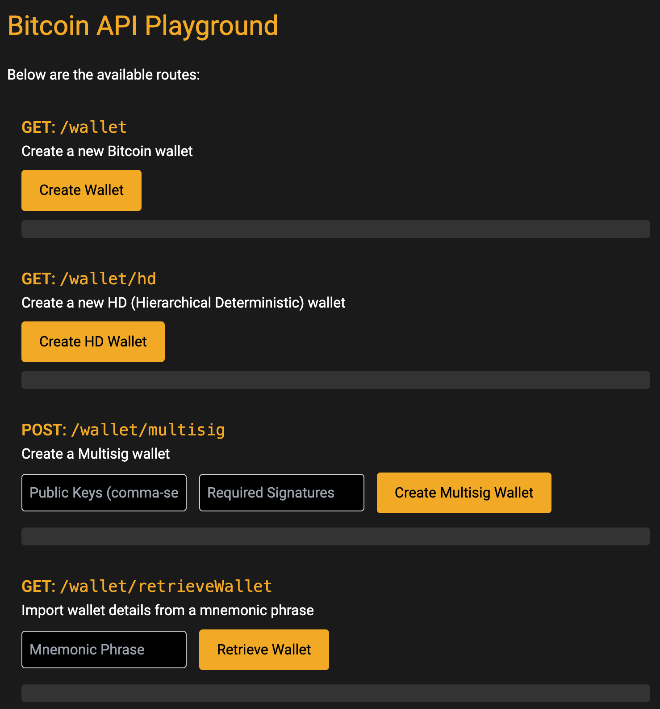

<!-- PROJECT SHIELDS -->

[![Forks][forks-shield]][forks-url]
[![Stargazers][stars-shield]][stars-url]
[![Issues][issues-shield]][issues-url]
[![MIT License][license-shield]][license-url]

# Bitcoin API Playground

Welcome to the ₿itcoin API Playground, a comprehensive and interactive API environment designed for experimenting with Bitcoin wallets, transactions, and blockchain interactions. Our toolkit offers a hands-on approach to understanding and implementing Bitcoin-related functionalities.

## Project Checklist



- [x] Create wallet
- [x] Create HD wallet
- [x] Create Multisig Wallet
- [x] Retrieve Wallet from MNEMONIC
- [x] Get balance of an address
- [x] Get transactions of an address
- [x] Verify transaction
- [x] Send transaction
- [x] Receive transaction using QR Code
- [x] Create timelock transaction
- [x] Estimate transaction fee
- [x] Validate Bitcoin address
- [x] Fetch historical Bitcoin data
- [ ] Implement reimbursement functionality
- [ ] Implement recurring payments functionality

## Getting Started

To get started with the API, follow the steps below:

1. Install the required dependencies:
   ```
   npm install
   ```
2. Clone the repository to your local machine:
   ```
   git clone https://github.com/ac12644/bitcoin-api-playground.git
   ```
3. Navigate to the project directory:
   ```
   cd bitcoin-api-playground
   ```
4. Install the project dependencies:
   ```
   npm install
   ```
5. Start the server:
   ```
   node app.js
   ```

Now you're ready to interact with the API endpoints described below.

## API Endpoints

### Create Wallet

- **Endpoint:** `/wallet`
- **Method:** GET
- **Description:** Create a new wallet and get its details.

### Create HD Wallet

- **Endpoint:** `/wallet/hd`
- **Method:** GET
- **Description:** Create a new hierarchical deterministic (HD) wallet and get its details.

### Create Multisig Wallet

- **Endpoint:** `/wallet/multisig`
- **Method:** POST
- **Request Body:**

```json
{
  "publicKeys": ["public_key_1", "public_key_2", "public_key_3"],
  "requiredSignatures": 2
}
```

- **Description:** Create a Multisig wallet.

### Retrieve Wallet

- **Endpoint:** `/wallet/retrieveWallet`
- **Method:** GET
- **Description:** Import wallet details from a mnemonic phrase.

### Get Balance

- **Endpoint:** `/transactions/balance/:address`
- **Method:** GET
- **Description:** Get the balance of a specific address.

### Get Transactions

- **Endpoint:** `/transactions/:address`
- **Method:** GET
- **Description:** Get the transactions associated with a specific address.

### Send BTC

- **Endpoint:** `/sendbtc`
- **Method:** POST
- **Description:** Send Bitcoin from a specific address to another.

### Timelock

- **Endpoint:** `/timeLock`
- **Method:** POST
- **Description:** Create a time-locked Bitcoin transaction.

### Estimate Transaction Fee

- **Endpoint:** `/feeEstimate`
- **Method:** GET
- **Description:** Estimate transaction fees based on network congestion.

### Validate Bitcoin Address

- **Endpoint:** `/validateAddress`
- **Method:** GET
- **Query Parameters:**
  address: The Bitcoin address to validate.
- **Description:** Validate the format of a Bitcoin address and determine if it belongs to the mainnet or testnet.

### Fetch Historical Bitcoin Data

- **Endpoint:** `/historicalData`
- **Method:** GET
- **Query Parameters:**
  startDate: The start date for the historical data (format YYYY-MM-DD).
  endDate: The end date for the historical data (format YYYY-MM-DD).
- **Description:** Fetch historical data for Bitcoin, such as past prices and transaction volumes.

## Examples

Here are some example requests and responses for the API endpoints:

### Create Wallet

**Request:**

```http
GET /wallet
```

**Response:**

```json
{
  "privateKey": "abcf123456789...",
  "address": "mvWqrftxCJa5eSKp229gkZbMf2XXrfZe9p"
}
```

### Create HD Wallet

**Request:**

```http
GET /wallet/hd
```

**Response:**

```json
{
  "xpub": "xpub6Dp5dtLR...",
  "privateKey": "xprv9s21ZrQH...",
  "address": "mvWqrftxCJa5eSKp229gkZbMf2XXrfZe9p",
  "mnemonic": "word1 word2 word3 ..."
}
```

### Get Balance

**Request:**

```http
GET /transactions/balance/:address
```

**Response:**

```json
{
  "balance": 0.01234567
}
```

### Get Transactions

**Request:**

```http
GET /transactions/:address
```

**Response:**

```json
{
  "transactions": [
    {
      "txid": "0004128cae112e3e1b4ae628b7a78c9ec105a120152ddf65c12f9398fbcb1b20",
      "version": 2,
      "locktime": 2437735,
      "vin": [
        {
          "txid": "8fa65fb497ce511a9134ebb8710b1e650148ce3c871b8a814509b938316786f7",
          "vout": 1,
          "prevout": {
            "scriptpubkey": "0014f10a55ec5dd506e2c84505b78c8d779d7cd1be4b",
            "scriptpubkey_asm": "OP_0 OP_PUSHBYTES_20 f10a55ec5dd506e2c84505b78c8d779d7cd1be4b",
            "scriptpubkey_type": "v0_p2wpkh",
            "scriptpubkey_address": "tb1q7y99tmza65rw9jz9qkmcerthn47dr0jtxtgg69",
            "value": 1224074
          },
          "scriptsig": "",
          "scriptsig_asm": "",
          "witness": [
            "3044022006d9e4b1633569311d7a9d8042c57fcb5857209a0e0d2abd8a8f07e96abebe270220708116a8dfe59617165b43bc3c393ace52dc111fbe67d23f032d137de5ae19a501",
            "0216013066fb948dd9cd8eaacb41913a71692254f36770a1d8b5b67f5e3d7a821d"
          ],
          "is_coinbase": false,
          "sequence": 4294967294
        }
      ],
      "vout": [
        {
          "scriptpubkey": "76a914e7d8367357aa01fbdc6b51c9cae3113059fb602688ac",
          "scriptpubkey_asm": "OP_DUP OP_HASH160 OP_PUSHBYTES_20 e7d8367357aa01fbdc6b51c9cae3113059fb6026 OP_EQUALVERIFY OP_CHECKSIG",
          "scriptpubkey_type": "p2pkh",
          "scriptpubkey_address": "n2eqQ65kSrDRHz5QYkGe3GTVDiJYeuatmV",
          "value": 7868
        },
        {
          "scriptpubkey": "76a9146a7c340d7b74f3d347182df2b049f535be8dbafd88ac",
          "scriptpubkey_asm": "OP_DUP OP_HASH160 OP_PUSHBYTES_20 6a7c340d7b74f3d347182df2b049f535be8dbafd OP_EQUALVERIFY OP_CHECKSIG",
          "scriptpubkey_type": "p2pkh",
          "scriptpubkey_address": "mqDziBnVjjFT9oZjRxNGPuatxTf245zybf",
          "value": 1216059
        }
      ]
    }
  ]
}
```

### Send BTC

**Request:**

```http
POST /sendbtc
```

**Request Body:**

```json
{
  "to": "destination_BTC_address",
  "amount": 0.01
}
```

**Response:**

```json
{
  "txId": "transaction_id"
}
```

### Verify Transaction

**Request:**

```http
POST /verifyTx
```

**Request Body:**

```json
// for multiple transactions
{
  "txids": ["transaction_id_1", "transaction_id_2", ...]
}

// for single transaction
{
  "txids": "transaction_id"
}

```

**Response:**

```json
{
  "txid": "transaction_id_1",
  "confirmed": true/false,
  "confirmations": "number_of_confirmations",
  "message": "Transaction is confirmed/unconfirmed."
}
```

### Verify Transaction

**Request:**

```http
POST /verifyTx
```

**Request Body:**

```json
// for multiple transactions
{
  "txids": ["transaction_id_1", "transaction_id_2", ...]
}

// for single transaction
{
  "txids": "transaction_id"
}

```

**Response:**

```json
{
  "txid": "transaction_id_1",
  "confirmed": true/false,
  "confirmations": "number_of_confirmations",
  "message": "Transaction is confirmed/unconfirmed."
}
```

### Estimate Transaction Fee

**Request:**

```http
GET /feeEstimate
```

**Response:**

```json
{
  "1": 87.882,
  "2": 85.123,
  ...
}
```

### Validate Bitcoin Address

**Request:**

```http
GET /validateAddress?address=yourBitcoinAddressHere
```

**Response:**

```json
{
  "address": "yourBitcoinAddressHere",
  "isValid": true,
  "network": "mainnet"
}
```

### Fetch Historical Bitcoin Data

**Request:**

```http
GET /historicalData?startDate=2022-01-01&endDate=2022-01-31
```

**Response:**

```json
{
  "prices": [...],
  "volumes": [...]
}
```

## Getting Test BTC

To get test BTC for your generated wallet, you can visit [testnet-faucet.com](https://testnet-faucet.com/btc-testnet/) which provides a faucet for Bitcoin testnet.

## Contributions

Contributions are welcome! If you find any issues or have suggestions for improvement, please feel free to contribute by creating a pull request.

Happy learning and exploring with your Bitcoin wallet API!

Feel free to modify and customize the content according to your specific needs.

<!-- MARKDOWN LINKS & IMAGES -->

[forks-shield]: https://img.shields.io/github/forks/ac12644/bitcoin-api-playground?style=for-the-badge
[forks-url]: https://github.com/ac12644/bitcoin-api-playground/network/members
[stars-shield]: https://img.shields.io/github/stars/ac12644/bitcoin-api-playground?style=for-the-badge
[stars-url]: https://github.com/ac12644/bitcoin-api-playground/stargazers
[issues-shield]: https://img.shields.io/github/issues/ac12644/bitcoin-api-playground?style=for-the-badge
[issues-url]: https://github.com/ac12644/bitcoin-api-playground/issues
[license-shield]: https://img.shields.io/github/license/ac12644/bitcoin-api-playground?style=for-the-badge
[license-url]: https://github.com/ac12644/bitcoin-api-playground/blob/main/LICENSE
